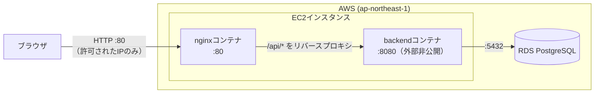

# インフラ構成：Trello風タスク管理アプリ

[← 要件定義書に戻る](requirements.md)

## 改訂履歴

**1.0 / 2026-08-02**  
初版作成。Terraform・Dockerで構築したAWSデプロイ構成を記載

## 1. 全体構成

- frontend（React）はビルド後の静的ファイルとしてnginxコンテナに同梱し、nginxが配信する
- backend（Spring Boot）はnginxコンテナとは別のコンテナとして起動し、EC2上のDockerネットワーク内でのみnginxと通信する（ホストの外からは8080番に直接アクセスできない）
- データベースはコンテナ化せず、AWSのマネージドサービス（RDS）を利用する
- VPC・サブネットは新規作成せず、デフォルトVPCをそのまま利用する

## 2. AWSリソース構成

- リージョン：ap-northeast-1（東京）
- EC2インスタンスタイプ：無料利用枠対象のクラス（アカウントの無料利用枠ページで確認したものを使用）
- EC2 AMI：Amazon Linux 2023（SSMパラメータストア経由で常に最新版を取得）
- EC2ルートボリューム：gp3、無料利用枠の範囲内のサイズ
- RDSエンジン：PostgreSQL 16
- RDSインスタンスクラス：無料利用枠対象のクラス
- RDSストレージ：gp2、無料利用枠の範囲内のサイズ
- RDS可用性：Multi-AZ無効（単一AZ、無料利用枠の範囲に収めるため）
- RDS公開設定：非公開（`publicly_accessible = false`。EC2のセキュリティグループからのみ到達可能）
- RDSバックアップ：自動バックアップの保持期間を最小限に設定（本アプリはデータ消失時の復旧要件を定めていないため）

## 3. ネットワーク・セキュリティグループ

- EC2用セキュリティグループ
  - 22番（SSH）：作業者のIPアドレスからのみ許可
  - 80番（HTTP）：作業者のIPアドレスからのみ許可（不特定多数には公開していない）
- RDS用セキュリティグループ
  - 5432番（PostgreSQL）：EC2のセキュリティグループからのみ許可（インターネットには非公開）
- 認証情報（DBパスワード・SSH秘密鍵）はTerraformの変数として管理し、値そのものは`.gitignore`対象のファイル（`terraform.tfvars`等）に置く。リポジトリには含めない

## 4. コンテナ構成（EC2上）

- nginxコンテナ
  - frontendのビルド済み静的ファイルを配信
  - `/api/`宛のリクエストをbackendコンテナへリバースプロキシ
  - frontendはビルド時にAPIの接続先を相対パスにしているため、環境（IPアドレス等）が変わってもfrontend側の再ビルドは不要
- backendコンテナ
  - Spring Bootアプリケーション本体
  - RDSへの接続情報は環境変数で渡す
  - メモリが限られたインスタンスで動かすため、JVMのヒープ上限を明示的に設定している
- 両コンテナはDockerのユーザー定義ネットワークで接続し、コンテナ名で互いを参照する
- バックエンド起動時にFlyway（`backend/src/main/resources/db/migration/`）が自動でテーブル作成・初期データ投入を行うため、RDS側での手動セットアップは不要

## 5. Terraform管理範囲

`terraform/`ディレクトリ配下でAWSリソースをコード管理している。

- `providers.tf`：利用するTerraformプロバイダの宣言
- `variables.tf`：インスタンスタイプ・許可IP・DB認証情報などの変数定義
- `main.tf`：EC2インスタンス・セキュリティグループ（SSH・HTTP）・SSH鍵ペア
- `rds.tf`：RDSインスタンス・RDS用セキュリティグループ・DBサブネットグループ
- `outputs.tf`：`terraform apply`後に表示する接続情報（EC2のIPアドレス、RDSのエンドポイント等）

state（Terraformの管理台帳）・鍵ファイル・`terraform.tfvars`はリポジトリに含めていない（`terraform/.gitignore`で除外）。

## 6. デプロイの流れ（概要）

1. `terraform apply`でEC2・RDS等のAWSリソースを作成する
2. backend・frontendそれぞれをDockerイメージとしてローカルでビルドする（EC2は1GBメモリのため、イメージビルドはEC2上では行わない）
3. ビルドしたイメージをEC2に転送し、コンテナとして起動する

CI/CDによる自動デプロイは未整備で、現状は手動（コマンド実行）でのデプロイとなる。

## 7. 既知の制約

- HTTPS（TLS）には対応していない
- ログイン機能がないため、セキュリティグループでのIP制限が唯一のアクセス制御になっている
- RDSの自動バックアップはあるが、EC2・RDSを削除（`terraform destroy`）するとデータは失われる
